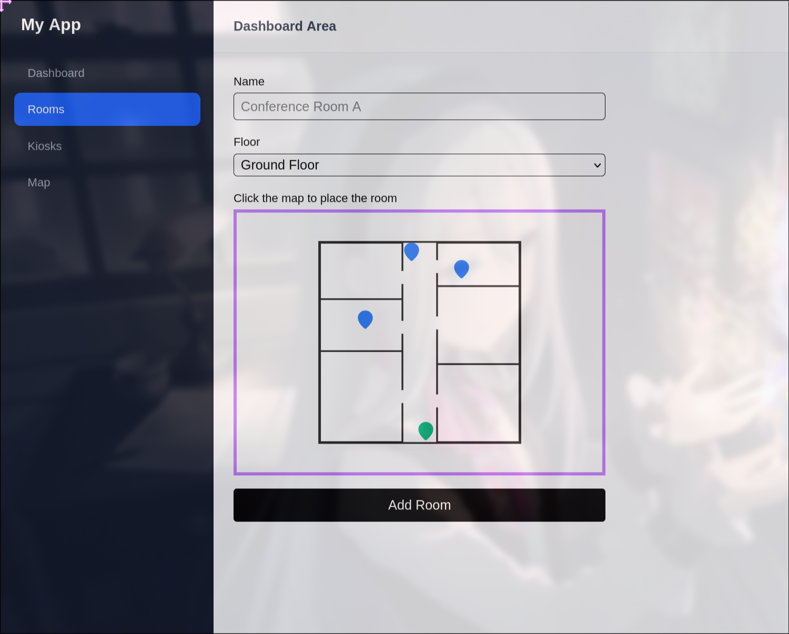
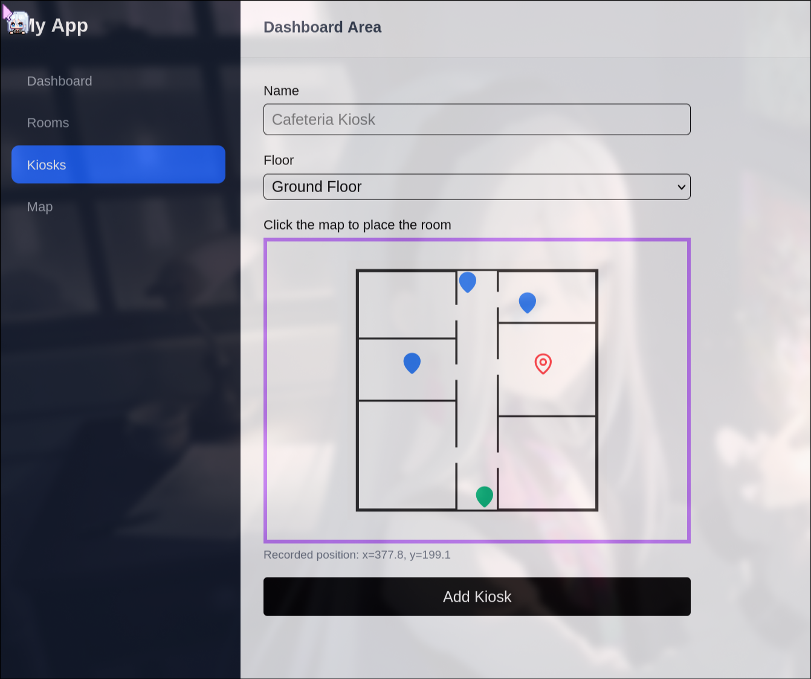
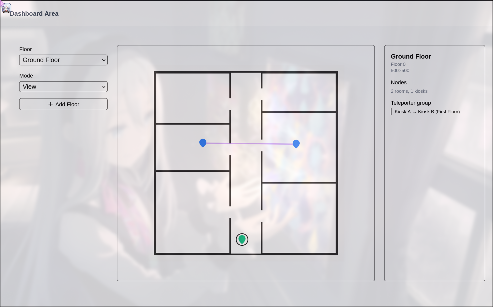
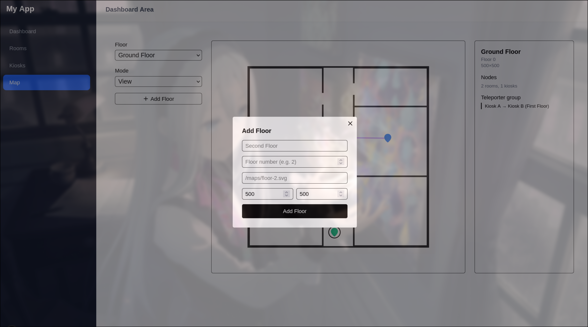

## Showcasing how POST room, kiosk, and map

## Note
Before you begin, please clone the project
```bash
git clone https://github.com/Cheasbite/Integration-map.git
```
Then run
```bash
npm install
```

Now you should be able to run the project which then please go to /dashboard

PS: The code is bad, please look away

## On room and kiosk



### Color code definitions:
- Blue identifies the existing rooms on that floor
- Green identifies the existing kiosks on that floor
- Red is the selected coords to submit the back-end (posX, posY aka verticies too but Claude says its unecessary)

So the goal in rooms is to:
- View existing rooms
- Add a new rooms
- When adding a new rooms, add the "verticies" in the map before sending it

### Same can be said with kiosk

## Map



### Exclusive to Map Dashboard only
- Able to see the connected nodes (drawn with purple line)
- Able to see the cross referenced nodes (teleporters), black circled
- Add new floors

### The main goal in Map Dashboard
- Create new floor
- Connect nodes
- Create Teleporters

## Notice
This is just a showcase of my idea with tweaks for the database, I'm sharing that in the video.
It's not a replacement of the previous idea but this one should be done instead to allow us to efficiently
integrate with our current project without massive changes.

- This lacks the logic that show the ideal path from one node to another
- This lacks the button to show the ideal path
- This lacks the logic to check if the placement is directly on top of another
- No side view to allow user to see what is being connected
- No information view that tells the node properties

### What this likely propose:
- No building table
- The verticies will be change to position coords because we need to know the exact placement of the objects
- 2 new tables, Node table and Edge table where the Node Table is responsible for giving out the information of the objects
and Edge table to handle the connected verticies in the floor and teleporters
- Now to sending things in the database would become a transaction of 2 database (A handshake between node table and another table)
else both will fail

### Side Effects:
- Since we are introducing 2 new tables (node and edge) where node shall store the positions of kiosk and room,
this would mean that room and kiosk positions will be redundant therefore it will be removed alongside the its referenced to the floorId
(removed floorId referenced, posX, posY, and the kiosk or room id will exactly matched node Id [eg. if room id is 01e then node id would also be 01e])
- We are adding new database which means we have to migrate our previous values and add it back with drizzle (Not sure how hard the process will be yet)
and do a drizzle push to update it in neon. (Note: we should do it inside of neon first without affecting our main database!)
- We no longer store positions in a "{100}x{200}" manner and separate things entirely with a dedicated row for each of these values
(It is optional though and keeping it is also wise since it won't break our split logic too much on the front-end)

### Positives:
- We can still fetch and post normally despite posX, posY, floorId beeing removed in certain places. Just POST like how we used too and
it will perfectly put the necessary stuff in the database though the back-end has to make the transaction clear in route.ts
- We retain most of our front-end without massive overhaul changes but the back-end will have to implement small necessary steps such as
new database (Node Table and Edge Table) with relations defined and each route.ts has to implement the transaction correctly.

### Technicals:
Below is how the back-end is expected to do in those route.ts
```
// When POSTing to the back-end: (/api/rooms only)
const created = await db.transaction(async (tx) => {
  await tx.insert(nodesTable).values({
    id,
    type: "room",
    floorId,
    px,
    py,
  });

  const [room] = await tx
    .insert(roomsTable)
    .values({
      id,
      name,
    })
    .returning();

  return room;
});
```
and for GET
```
// GETting the value and sending to the front-end (front-end only fetch /api/rooms and they get everything)
const rooms = await db.query.nodesTable.findMany({
  where: floorId ? eq(nodesTable.floorId, floorId) : undefined, // In our case we just do findMany({ with: { room: true }})
  with: {                                                       // But in our [id] we do findMany({ where(eq(roomTable.id, id)), with: { room: true, })
    room: true,
  },
});

// nodesTable also matches kiosks, so filter to rooms only
// and flatten node + room fields into one object per room.
const result = rooms
  .filter((node) => node.type === "room" && node.room !== null)
  .map((node) => ({
    id: node.id,
    name: node.room!.name,
    floorId: node.floorId,
    px: node.px,
    py: node.py,
  }));
```
So the front-end response would be the same as our previous:
```
// I may get this wrong but the response format should be the same as how we implemented it!
{
    success: 200,
    data: [
        {
            id:
            name:
            posX:
            posY:  // For these posX, posY (we can choose to do "posXxposY" if we want to)
            floorId:
            ...
        }
    ]
    meta: {
        ...
    }
}
```

